[TOC]

# yys自动化工具（不再更新）

## 写在前面

2021.03.22 补充：**工具不再进行更新**，也不再提供程序下载。仓库暂时不撤掉，供学习 python 的有缘人一起交流学习。仓库随时有可能会把权限改为私有，所以小伙伴们可以自行 clone 一份到本地。


今天是 2021.1.1 ，我想这个工具是 2020 年，我最上心的一件事情。最初的时候，我只是想写一个阴阴师的辅助工具，比如用来辅助升级狗粮，樱饼不够用时也可以自动刷魂土，自动刷结界突破等等。开始的时候用 autogui 随便写了一个，偷懒脚本随机性没做好，还被鬼使黑警告了一次，因此中间弃坑了一段时间。最后舍不得好友们，重新入坑。重构脚本是在一次面试的时候被问到了设计模式，一知半解的时候看了两周的设计模式，知道为啥之前开发的脚本那么难维护了。索性重构了框架，这次是重构之后一开发记录。

先说明一下当前软件支持的功能：

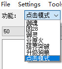

后面针对每个功能都从使用方法，注意事项，开发记录几个方面详细介绍。对于使用者，只要看对应的使用方法就可以了。

特别说明，**点击模式**是因为我在写王者荣耀自动挂血红色宫殿的时候，发现腾讯手游助手的模拟器没有办法通过脚本调节窗体大小（有开发大佬知道怎么解决可以联系我），每次都得重新截图，所以干嘛直接写一个通用的只需要匹配-解析的通用模式。最终还是拿来挂血红色宫殿。其实御灵也可以简单截几个图变成**点击模式**实现。

**本工具仅用来学习交流，请不要扩散，公平游戏环境需要大家一起维护。使用过程中如遇鬼使黑警告，封号处理本人概不负责。**


拆分文档为使用文档和开发文档，本文是使用文档。

详细开发文档：[详细开发文档](./docs/开发说明文档.md)


## 软件使用介绍

我按一个没有用本工具的使用者的角度，一步步按使用步骤来说明。

### 软件环境说明

- 软件环境说明，win7/win10，非4K屏显示器（之前有朋友反馈4K屏不能正常使用）

### 软件获取

gitee上不存放软件包，所以有兴趣的朋友可以直接联系我。当然做开发的朋友可以自己打包。可以加群，添加请增加备注。

点击链接加入群聊：https://jq.qq.com/?_wv=1027&k=TpuzYIDs


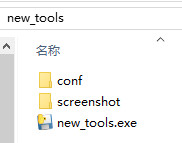

其中 **conf 下面是配置文件**， screenshot 下面是用来匹配的截图文件， .exe 文件是可执行文件。使用时直接点击 .exe 文件即可。基本使用都也只要关心配置文件和可执行文件就可以了。

成功打开后的界面如下：

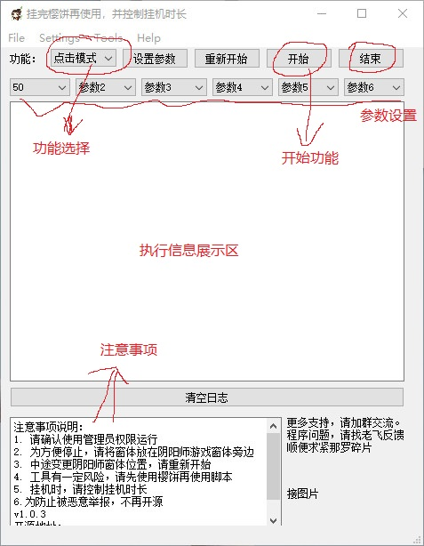

启用一个功能的顺序：

1. 选择对应功能
2. 参数设置的那6个选项中设置对应的参数
   1. 参数获取顺序
      1. 界面设置的参数
      2. conf/config.ini 中对应功能的参数
3. 点击开始进行挑战

### 配置参数

参数在 conf 文件夹下面的 config.ini 文件中，右键用记事本打开，下图是用 notepad++ 打开。

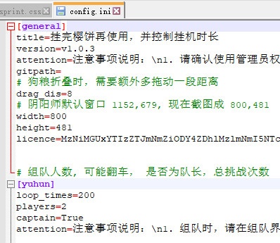

ini格式说明：

1. [general]，[]包含的是哪个功能配置，general是通用信息，用来设置界面
   1. title，窗口标题
   2. attention，注意事项
   3. width，height，窗体大小（不能更改）
   4. licence，认证码，用来限定认证过期时间
   5. 其他#开头的是注释说明
   6. 其他没有特别说明可能是冗余配置，没有实际作用

看[yuhun]即指御魂功能的配置信息，后面说明御魂功能的时候再介绍具体意思 

### 截图文件

screenshot 下面是按功能进行分类的对应截图，不要随意更改。如果遇到某几个界面特别不准的，可以反馈，尽量不要自己改动。

### 软件使用的技术

概括就是 图片识别 + 自动点击，当然实际还要更复杂的多。要模拟人为的识别和人为的点击，所以需要增加随机数来模拟。之前没有加随机数就被检测到使用第三方软件。目前使用几个月，都正常。

当匹配不到截图时，是不会去点击界面的，相当于在线挂机。没有什么影响。

### 鬼使黑警告

**不保证绝对安全，但是已经在用了几个月，反正我自己是放心的。**

当前和好友已经用了1年多了，除了之前爬塔活动那次没加随机数，且连续半夜挂着挂了几个晚上，被警告。后续克制这种半夜挂机的反人类行为之后，都正常。

另外，点击都是用随机数，比如点击“准备”每一次都不会点击在同一个位置。程序也在使用过程中不断优化。


## 御灵

### 使用方法

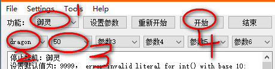

只要在符合下面两个图中状态，都是可以正常进入循环挑战。

准备循环：

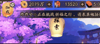

进入循环的位置：


### 注意事项

如果对应的类型没有开放的话，会自动切换类型，默认类型是豹子 -> 狐狸 -> 凤凰 -> 神龙。

## 御魂

### 使用方法

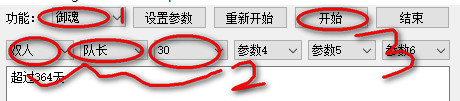

### 参数说明

总共涉及的参数有下面几个：

1. 单人，双人，三人
2. 队长，队员
3. 循环次数

### 循环状态

只要在符合下面两个图中状态，都是可以正常进入循环挑战。

准备循环：

御魂的话涉及组队，不做准备阶段的判断，所以默认启用时已经是进入循环的某个界面。


进入循环的位置：

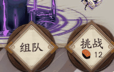


### 注意事项

因为组队挑战的话，涉及邀请组队和接受邀请组队的情况。如果此时有其他人邀请你打妖气封印的话，会点击接受，从而退出挑战。所以如果你好友比较多，大家都喜欢拉你打个妖气封印，金币妖怪，经验妖怪什么的，你可以还是得过一小会儿来看一下是不是被邀请走了。

单人挑战实际没有测试，不确定哪个细节的逻辑没有考虑进行，如果使用请自行测试，有需要的话再反馈给我，我再加进去。


## 业原火

### 使用方法

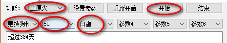

业原火我都是拿来作为狗粮，如果不带狗粮的话就不用看后面的了。

带狗粮的话，我一般是1+1+3。所以我限定的狗粮区域只有3只会去替换。更换狗粮时根据选择的狗粮类型进行替换。

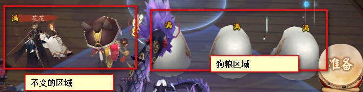

### 参数说明

总共涉及的参数有下面几个：

1. 更换狗粮，不更换
2. 循环次数
3. 狗粮类型，如果选择不更换，这个参数没有什么意思。

### 循环状态

只要在符合下面两个图中状态，都是可以正常进入循环挑战。

准备循环：

进入循环的位置：

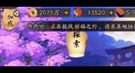


### 注意事项

业原火的狗粮替换目前没有遇到说满级的狗粮没有更换的情况。n卡的话我试得不对，如果有没有替换成功的情况，可以跟我反馈。


## 结界突破

### 使用方法

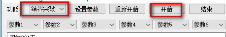

结界突破的流程：

1. 进行寮突破，直接全部完成，或者是6次用完了
2. 进行个人突破，直接没有挑战券或者是9个格子中有挑战失败的情况
3. 当进入一个挑战时，指定第四个位置


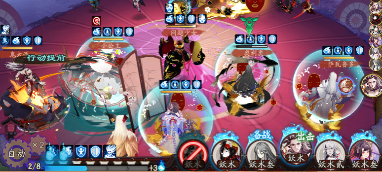

### 参数说明

结界突破不需要参数

### 循环状态

只要在符合下面两个图中状态，都是可以正常进入循环挑战。

准备循环：

御魂的话涉及组队，不做准备阶段的判断，所以默认启用时已经是进入循环的某个界面。


进入循环的位置：

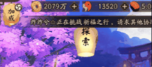


### 注意事项

当个人挑战的九个界面存在挑战失败时，也不再继续挑战。

锁定的位置是固定的，即只锁定第四个位置，需要将你要锁定的式神放在第四个位置。


## 升级狗粮

### 使用方法

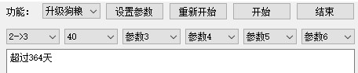

### 参数说明

总共涉及的参数有下面几个：

1. 升级狗粮可选，2->3表示2星升3星；3->4表示3星升4星，升级仅使用N卡狗粮。
3. 循环次数

执行流程：

1. 切换到式神录界面
2. 切换到按星级排列，宽松排列
3. 识别到是2->3还是3->4
4. 选择一只满级狗粮，并点击育成
5. 切换到N卡，喂狗粮，点击确认，确认升级
6. 点击确认，重复3-6，直到狗粮不够或者是达到指定数量的狗粮

### 循环状态

只要在符合下面图中状态，都是可以正常进入循环挑战。

准备循环：

进入循环的位置：


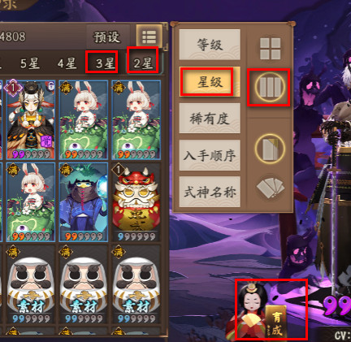

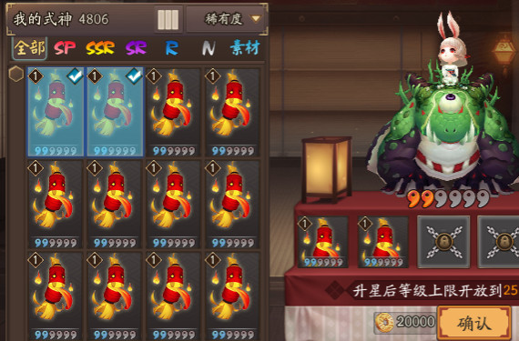

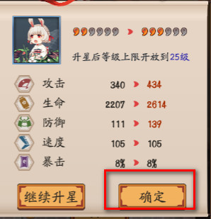


### 注意事项

无


## 困28

### 使用方法

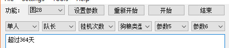

### 参数说明

总共涉及的参数有下面几个：

1. 单人，双人
2. 队长，队员
3. 循环次数
4. 狗粮类型


困28组队时，刚进入预选界面时，达摩会跳啊跳的，队长位置又比较小，可能存在没有识别到狗粮已经满级情况，但是多进入几次，应该是可以替换掉的。所以**队长存在一定概率不替换狗粮**。队员和单人测试很少会发生。因为这个功能测试得少，所以是**存在一定概率不替换狗粮**。

### 循环状态

只要在符合下面两个图中状态，都是可以正常进入循环挑战。

准备循环：

进入循环的位置：组队截图复杂，两个循环就不列了

### 注意事项

**存在一定概率不替换狗粮**。


## 点击模式

### 使用方法

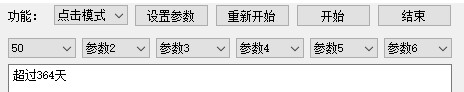

### 参数说明

总共涉及的参数有下面几个：

1. 循环次数

另外还需要修改 config.ini 中的配置

1. winname 可以设置具体软件名称，用其他模拟器的话，名称可能要另外获取，这个如果需要我可以提供小工具帮忙查询
2. prepare_keys 这个是第一个循环的key，不设置即直接认为是可以进入循环
3. loop_keys 这个是第二个循环的图片，注意不要写错了

```
[pattern]
loop_times=50
# 截图的名称,不要留空格
# loop_keys=step1,step2,step3,step4,step5,step6,step7
# prepare_keys=p1,p2,p3,p4
prepare_keys=
loop_keys=s1,s2,s3,s5,s6
attention=注意事项说明：\n1.该模式只适用于识别图片并点击的功能2.含有复杂逻辑时时不能用该模式
# None指截全图
winname=腾讯手游助手【极速傲引擎-7.1】
```

因为比较简单，我只列我用王者荣耀的几个关键key吧。


### 注意事项

因为每个图的回调都是点击，防止图片过小被鼠标遮挡，每次点击都会往右下角移动一定距离。

winname 实在不好设置时，设置成 None ，这个是截取整个屏幕。


## 常见问题及解决方法

### 无法打开界面

界面都出不来，联系我吧。

### 提示认证失败

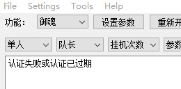

因为之前不扩散，不传播，我添加了对应的认证模式，遇到也联系我吧。

打开一个空的记事本文件，把下面两行添加进行，然后修改成 uuid.bat ，执行之后把得到的方字也拷贝给我。我生成一个认证码。拷贝到 config.ini 的 [general] 下的 licence 即可。

```
wmic csproduct get uuid
Pause
```

举例 config.ini 文件中增加下列串。

```
[general]
licence=ZGQ3ZTRmZTVmYmViMjdiY2Q4MTQ4NmZmYmI4YzU1ZTZfMTY0MDk2NjQwMA==
```


### 调整窗口大小失败

原因分析：没有管理员权限。

解决方法：右键程序，使用管理员身份运行程序。


### 提示截图对比失败

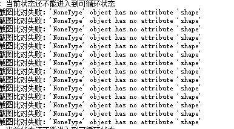

原因分析：程序放在了中文路径下，或者是程序跟图片没有放在目录下。

解决方法：将程序放在英文路径下。


### 御魂挑战一半退出去打别的

详细原因御魂挑战里面有详细说明，其实就是别人邀请时，会出现确认的选项，而这个选项优先级比较高，会接受邀请。目前不想去解决这个问题，建议一段时间去看一次执行情况吧。


### 明明有满级狗粮却没有进入切换狗粮的界面

困28有一定概率无法识别到狗粮，因为刚进图的时候，达摩还在跳，所以可能无法识别到“满”字，一般进图过慢的话才会遇到，如果是每一次都无法替换的话，建议考虑换N卡当狗粮，如果还是这样，那你可以反馈给我。


### 换下来的满级狗粮又被换上去了

原因分析：拖动的距离太小，导致重复选中。

解决方法：修改配置文件 config.ini 里面的这个参数 drag=3 ，可以视情况增大，比如改成5，修改完成之后**重新启用脚本**。

```
[chapter]
loop_times=400
players=2
captain=False
# ['fodder', 'ncard'], 狗粮拖动距离，建议白蛋如果有30级的白蛋，需要增加一些距离，如5, N卡不设置或设置0
fodder_type=fodder
drag=3
attention=注意事项说明：\n1. 阴阳师式神请尽量使用神乐或小晴明，不会遮挡式神\n2. 组队时如果是队长带输出式神，并放在第二排第一\n3. 队员带输出式神时，请放在第一排第一位
```


### 双开游戏的话可以用嘛

可以用，但是要启用和两个脚本程序。我自己没有去试过，但是在使用的朋友有试过，是可以做到的。**理论上对于鼠标操作时间比较久的场景（比如困28替换狗粮）可能会冲突。**

步骤如下：

1. 你开两个脚本，两个阴阳师。
2. 先点击一个阴阳师（选中），启动一个脚本，因为脚本是取出**最近被激活的那个阴阳师客户端**。此时取到阴阳师窗体1。
3. 再点击另外一个阴阳师（选中），启动别一个脚本。第二个脚本取到的是阴阳师窗体2。


## 意见反馈

加群 -> 描述问题 -> 群里咨询

如何描述问题？

1. 问题要描述清楚，如何操作以及具体问题现象。比如启动时提示调整窗体失败。如配上截图效果更好。
2. 将生成的 debug.log 文件一并附上


