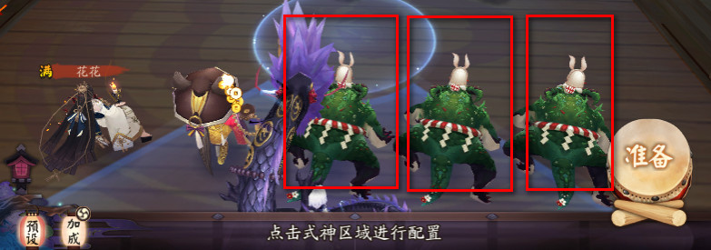
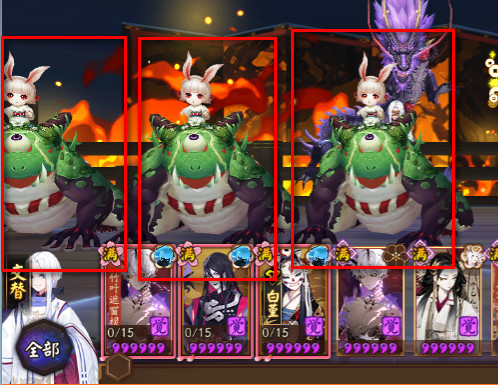
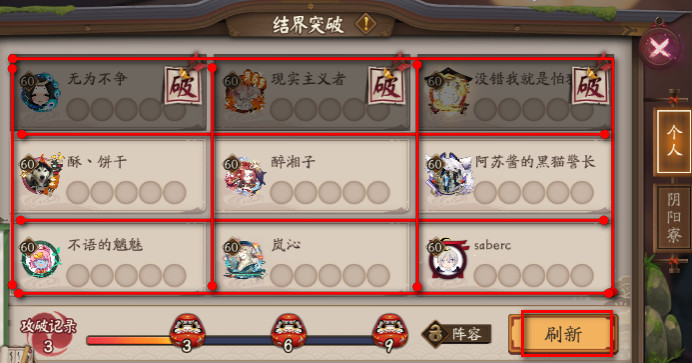
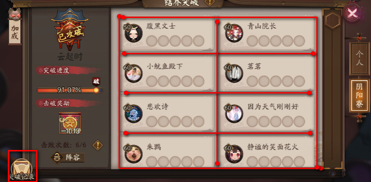

[TOC]

# yys自动化工具


本工具仅用来学习交流，请不要扩散！！！

公平游戏环境需要大家一起维护。使用过程中如遇鬼使黑警告，封号处理本人概不负责。

纯属业余开发的小工具，鉴于本人自己已经不怎么玩yys，所以后续不一定会继续更新。

如有官方人员反馈该仓库破坏游戏平衡，可联系本人进行取消公开；


## 软件使用介绍

我按一个没有用本工具的使用者的角度，一步步按使用步骤来说明。

### 软件环境说明

- 软件环境说明，win7/win10，非4K屏显示器（之前有朋友反馈4K屏不能正常使用）
- 软件本身没有跨平台，跨平台需要对库做跨平台处理，像 win32 和 autogui 都不支持跨平台，需要做扩展
- 请求先阅读过 README.md 文档之后再来看开发文档
- 都只用到了几个库的基础用法，有深入了解库需求的小伙伴可以自行去搜索对应库并进行学习

## 软件开发介绍

## 框架介绍

点击“开始”之后，软件跑起来的几个主要步骤：

1. config 配置解析
2. 截图文件加载
3. 设置循环前的截图对应的回调函数
4. 设置进入循环后的截图对应的回调函数
5. 循环准入检测
   1. 如果已经可以匹配到循环中的截图，说明可以进行循环
   2. 如果匹配到循环前的截图，执行对应的回调来处理，或点击或复杂操作，进入下一步
6. 循环后
   1. 根据通用信息 self.loop_times 决定循环执行多少次
   2. 根据对应功能特殊的配置进行各项基本操作


**特别说明：**

每一个具体知识点的分解，可以看**单功能调试**文件夹里面的 jupyter 文件。

如果 jupyter 没有安装，可以通过命令安装 jupyter ，

```
pip install jupyter
```


### 配置解析

配置的数据结构说明：

```
self.config, 所有的配置集合
self.config.general, 常规的配置，包含窗体名称之类的基础信息
self.config.yuling, 御灵功能对应的配置信息
self.config.yuhun, 御魂功能对应的配置信息
```

为了不过多得依赖配置信息，所以会在初始化功能的时候就把所有用到的配置转化成单个功能的配置，如御灵功能只用到了配置“循环次数”，“挑战类型”这两个配置。

```
class Yuling(Autogui):
    def __init__(self, win_name='阴阳师-网易游戏'):
        Autogui.__init__(self, win_name)
        # 设置当前副本的类型，设置之后优先查找御灵对应的截图
        self.screenshot.set_current_setion('yuling')  # 设置优先的截图信息
        self.config.set_current_setion('yuling')  # 设置当前配置信息
        self.pre_loop_times = self.config.cur_config.get('pre_loop_times', 20)
        self.loop_times = self.config.cur_config.get('loop_times', 20)
        self.fight_type = self.config.cur_config.get('type', 'leopard')
        self.already_select_layer = False
```

另外下面步骤也非常重要，用来设置当前优先选择的配置。尤其是图片的当前 section 必须设置。

```
self.screenshot.set_current_setion('yuling')  # 设置优先的截图信息
self.config.set_current_setion('yuling')  # 设置当前配置信息
```


目前支持的功能都是在列表中写死的。所以如果要增加一个功能时，要增加的下面几个操作：

1. config.ini 中增加类型
2. 界面的功能列表，mainwin.py 的 init_config()
3. 点击开始界面时，要显示去解析配置选项的参数 mainwin.py 的 get_config_from_param_cb()
4. 要使用对应功能来初始化  mainwin.py 的 btn_start_clicked


### 图片比对

图片比对最初用的是 autogui.locate() ，发现性能太差了，所以后面换了 opencv ，这一块有单独的调试文件，详细见 [opencv图像识别.ipynb](./单功能调试/opencv图像识别.ipynb)

比较单个图片：

```
im_yys = self.screenshot_exact()  # 获取截图
loc_tmp = self.locate_im(self.get_image(self.fight_type), im_yys) # 比对某个key是否在截图中
if loc_tmp:
    self.cur_key = self.fight_type
	self.click_loc_one(loc_tmp)
```

说到图片，还是先说下两个重要的函数： goto_loop() 和 loop()，分别对应循环前准备和进入循环。以御灵为例，两个过程中提取的关键流程如下，(key, callback) 分别对应关键 key 对应的执行函数是什么。

```
prepare_callback = [
    ('search', self.click_loc_one),
    ('yuling', self.click_loc_one),
    ('dragon', self.dragon_callback),
    ('fox', self.fox_callback),
    ('leopard', self.leopard_callback),
    ('phenix', self.phenix_callback),
]
loop_callback = [
    ('task_accept', self.task_accept_callback),
    ('fight', self.fight_callback),
    ('prepare', self.prepare_callback),
    ('victory', self.victory_callback),
    ('fail', self.fail_callback),
    ('award', self.award_callback),
]
```

然后将数据转换成对应一个中间类，如果用面向对象的思路，应该是接口，不过我这边简化掉，只存信息，不处理操作。

```
class ImageCallback():
    def __init__(self, key, image, callback):
        self.key = key
        self.image = image
        self.callback = callback
```

最终得到 (key, image, callback) 这样的关键信息的两个数组。

```
def init_image_callback(self, prepare_callback, loop_callback):
        '''格式化图片文件及对应的callback'''
        for each_callback in prepare_callback:
            callback = ImageCallback(each_callback[0],
                                     self.get_image(each_callback[0]),
                                     each_callback[1])
            self.prepare_image_callback.append(callback)
        for each_callback in loop_callback:
            callback = ImageCallback(each_callback[0],
                                     self.get_image(each_callback[0]),
                                     each_callback[1])
            self.loop_image_callback.append(callback)
```


### 准备循环

准备的循环，用来确定是否可以进行循环执行。

```
def goto_loop(self):
    self.cur_loop_times = 0
    while self.stop is False and self.cur_loop_times < self.pre_loop_times:
        im_yys = self.screenshot_exact()
        found = False
        if self.already_in_loop(im_yys):
            return True

        im_yys = self.screenshot_exact()  # 执行操作之后需要重新获取截图
        for callback in self.prepare_image_callback:
            self.cur_loop_times += 1
            loc = self.locate_im(callback.image, im_yys)
            if loc is None:
                print(callback.key, ' not match')
                continue
            self.cur_key = callback.key
            callback.callback(loc)  # 执行对应的回调
            time.sleep(1)
            found = True
            break

        if found is False:
            time.sleep(1)
    return False
```


### 循环数组

进行循环之后，就只会识别循环列表里面的图片。同时除非点击退出，达到循环次数，或者是异常崩溃才会退出。

```
def loop(self):
    self.cur_loop_times = 0
    while self.stop is False and self.cur_loop_times < self.loop_times:
        im_yys = self.screenshot_exact()
        found = False

        im_yys = self.screenshot_exact()  # 执行操作之后需要重新获取截图
        for callback in self.loop_image_callback:
            if callback.image is None:
                self.display_msg('请确认截图{}存在'.format(callback.key))
                continue
            loc = self.locate_im(callback.image, im_yys)
            if loc is None:
                continue
            self.cur_key = callback.key
            callback.callback(loc)  # 执行对应的回调
            time.sleep(0.5)
            found = True
            break

        if found is False:
            self.display_msg('该轮匹配不到图片')
            time.sleep(1)
```

### 界面开发

用的是 pyqt5 ，这里就不展开了，一些坑和注意事项等等后面有时间再另外写。

毕竟不是做UI的，凑合可以用就好了。

## 御灵

御灵是最简单的一个部分。

因为是第一次说明模块，所以把两个循环贴出来。

```
prepare_callback = [
	('search', self.click_loc_one),
	('yuling', self.click_loc_one),
	('unopened', self.unopened_callback),
	('dragon', self.unopened_callback),
	('fox', self.unopened_callback),
	('leopard', self.unopened_callback),
	('phenix', self.unopened_callback),
]
loop_callback = [
	('task_accept', self.task_accept_callback),
	('fight', self.fight_callback),
	('prepare', self.prepare_callback),
	('victory', self.victory_callback),
	('fail', self.fail_callback),
	('award', self.award_callback),
]
```

其中只有是**类型切换**和**挑战**是需要特别写回调的，其他都用通用的回调就可以了。

挑战是因为我们还需要切制到第三层。

```
def fight_callback(self, loc):
if self.already_select_layer is False:
	im_yys = self.screenshot_exact()
	loc_tmp = self.locate_im(self.get_image('layer3'), im_yys)
	if loc_tmp:
		self.click_loc_one(loc_tmp)
	else:
		self.display_msg('无法找到第三层：{0}'.format('layer3'))
		return
	self.already_select_layer = True
else:
	self.click_loc_one_and_move_uncover(loc)
```

类型切换的话，我们将界面选择的那个类型设置为第一个，其他的还是按照默认顺序挑战，如果挑战失败之后再进行切换下一个类型。

```
def _fighttype_callback(self, fight_type):
	im_yys = self.screenshot_exact()
	loc_tmp = self.locate_im(self.get_image(fight_type), im_yys)
	if loc_tmp:
		self.cur_key = fight_type
		self.click_loc_one(loc_tmp)
	else:
		self.display_msg('无法切换到类型：{0}'.format(fight_type))

def unopened_callback(self, loc):
	if len(self.remain_types) == 0:
		self.stop = True
		self.display_msg('所有类型都未开放')
	self.last_fight_type = self.remain_types[0]
	self.remain_types.remove(self.remain_types[0])
	self._fighttype_callback(self.last_fight_type)
```


## 御魂

这是第一个涉及组队的脚本。所以还是得先把所有队长的可能操作，以及队员的可能操作都考虑到，都写到回调的数组里面，然后在需要区分的回调函数里面去指定队长和队员的操作。

列出需要特别处理的循环：

```
loop_callback = [
	('task_accept', self.task_accept_callback),
	('always_accept', self.always_accept_callback),
	('accept', self.accept_callback),  # 队员默认接受邀请
	('fight', self.fight_callback),  # 单人挑战
	('team_fight', self.team_fight_callback),  # 组队挑战
	('time', self.void_callback),
	('yes', self.yes_callback),  # 确认，队长默认邀请队员
	('confirm', self.click_loc_one),  # 确定
	('prepare', self.prepare_callback),
	('victory', self.victory_callback),
	('fail', self.fail_callback),
	('award', self.award_callback),
]
```


**组队挑战**，队长需要等待队员到来，通过比较玩家人数和当前缺席人数计算出来，缺席人数通过下图获取。


当人数都到齐之后，队长才会点击开始挑战。

```
def team_fight_callback(self, loc):
	need_wait_player = False
	if self.captain:
		im_yys = self.screenshot_exact()
		if self.players == 2:
			im_absent = self.screenshot_inc(320, 80, 150, 200)
			if self.locate_im(self.get_image('absent'), im_absent):
				need_wait_player = True
		elif self.players == 3 and self.locate_im(self.get_image('absent'),
												  im_yys):
			need_wait_player = True

		if need_wait_player:
			self.display_msg('队员还未来齐，需要等待队友来齐')
		else:
			self.click_loc_one(loc)
		time.sleep(1)
```

**准备状态**，因为默认邀请时是不需要再点击准备状态，所以这个时候需要重载之前通用的准备回调。我这边的设定是前4次挑战会点击准备，4次之后或者在默认接受邀请之后不会再点击准备。当不是默认接受邀请而是单 欠邀请时，需要将准备的点击次数重新置为0。

```
def prepare_callback(self, loc):
	if self.prepare_click_times < 4:
		self.click_loc_one_and_move_uncover(loc)
		self.prepare_click_times += 1
		time.sleep(1)
	self.click_success_check('prepare', self.prepare_callback)

def always_accept_callback(self, loc):
	self.prepare_click_times = 10  # 默认邀请之后不需要重新点击准备
	self.cur_key = 'always_accept'
	self.click_loc_one(loc)

def accept_callback(self, loc):
	self.prepare_click_times = 0  # 重新归零，需要点击准备
	self.cur_key = 'accept'
	self.click_loc_one(loc)
```

**默认邀请**，默认邀请时，需要点击默认邀请前的那个空格，这个是仅有的**没有设置随机数**的几个点击之一，因为次数极少，所以影响不大。

```
def yes_callback(self, loc):
	loc_tmp = self.locate_im(self.get_image('default_invite'))
	if loc_tmp:
		self.display_msg('设置为默认邀请队友')
		self.cur_key = 'default_invite'
		self.click_loc_inc(loc_tmp.left - 20, loc_tmp.top + 9, 1)
		self.cur_key = 'yes'
		time.sleep(0.5)
		self.click_loc_one(loc)
```

特别说明，self.cur_key 的设置是为了点击操作时，将当前识别的操作也打印出来。因为如果是走通用框架，我是会在匹配到截图的时候，设置成截图的名称。但是如果是扩展的这类配置，可能包含多个动作，所以**如果想要准确打印当前操作，需要在每个含有点击操作前设置 self.cur_key** 。

## 业原火

这是第一个涉及组队的脚本。所以还是得先把所有队长的可能操作，以及队员的可能操作都考虑到，都写到回调的数组里面，然后在需要区分的回调函数里面去指定队长和队员的操作。

列出需要特别处理的循环：

```
loop_callback = [
	('yeyuanhuo', self.click_loc_one),
	('task_accept', self.task_accept_callback),
	('fight', self.fight_callback),
	('prepare', self.prepare_callback),
	('victory', self.victory_callback),
	('fail', self.fail_callback),
	('award', self.award_callback),
	('time', self.void_callback),
]
```


**挑战**，第一次时需选择痴再进行挑战。

```
def fight_callback(self, loc):
        if self.already_select_chi:
            self.click_loc_one(loc)
            return

        loc_tmp = self.locate_im(self.get_image('chi'))
        if loc_tmp:
            self.cur_key = 'chi'
            self.already_select_chi = True
            self.click_loc_one(loc_tmp)
            time.sleep(0.5)
        self.cur_key = 'fight'
        self.click_loc_one(loc)
```

**准备**状态，准备这个操作重载要处理重点是在初始界面要检测是否有满级狗粮，交换界面时要交换狗粮。

核心是检测是否有满级狗粮，把狗粮的位置用框框画出来，然后判断框框内是否有“满”字样即可。提前准备好相对位置的数组即可 。





```
self.exchange_locs = [[0, 110, 130, 200], [130, 110, 174, 200],
					  [304, 110, 176, 200]]
self.preinstall_locs = [[310, 220, 133, 200], [447, 220, 133, 200],
						[577, 220, 133, 200]]
```

同时判断多个位置满级状态的处理。

```
def get_all_images_by_locs(self, key, locs):
        '''从各个locs中获取到最终的位置信息'''
        locations = []
        for i in range(len(locs)):
            im_tmp = self.screenshot_inc(locs[i][0], locs[i][1], locs[i][2],
                                         locs[i][3])
            # im_tmp.show()
            loc_tmp = self.locate_im(self.get_image(key), im_tmp)
            if loc_tmp:
                loc_tmp.left += locs[i][0]
                loc_tmp.top += locs[i][1]
                locations.append(loc_tmp)
        return locations
```


对准备状态进行重载，并区分预设界面和交替界面的不同操作。

```
def prepare_callback(self, loc):
        if self.change_fodder is False:
            self.click_loc_one(loc)
            return

        # 预设界面：刚进入挑战，含有预设的界面
        im_yys = self.screenshot_exact()
        loc_tmp = self.locate_im(self.get_image('preinstall'), im_yys)
        if loc_tmp:
            locations = self.get_all_images_by_locs('man',
                                                    self.preinstall_locs)
            man_nums = len(locations) if locations else 0
            if man_nums > 0:
                random_x = uniform(-10, 10)
                random_y = uniform(-10, 10)
                self.cur_key = 'exchange_preinstall'
                self.click_loc_inc(350 + random_x, 320 + random_y, 1)
            else:
                self.display_msg('当前不需要更换狗粮')
                self.click_loc_one(loc)
                time.sleep(1)  # 避免太过频繁去点击准备
            return

        # 交换式神界面
        loc_tmp = self.locate_im(self.get_image('exchange'), im_yys)
        if loc_tmp:
            locations = self.get_all_images_by_locs('man', self.exchange_locs)
            man_nums = len(locations)
            if man_nums > 0:
                self.cur_key = 'change_fodder_type'
                self.change_fodder_type(self.fodder_type)
                self.cur_key = 'exchange_fodder'
                self.exchange_fodder(locations, self.drag)
                self.display_msg('狗粮替换完成')
            else:
                self.click_loc_one(loc)
```

**交换狗粮**，交换狗粮分两步，一是**切换狗粮类型**。

```
def change_fodder_type(self, fodder_type: str):
        im_yys = self.screenshot_exact()
        loc_tmp = self.locate_im(self.get_image(fodder_type), im_yys)
        if loc_tmp:
            self.display_msg('已经是选中的狗粮类型')
            return

        all_types = [
            'all', 'fodder', 'ncard', 'rcard', 'srcard', 'ssrcard', 'spcard'
        ]
        all_types.remove(fodder_type)
        for each in all_types:
            loc_tmp = self.locate_im(self.get_image(each), im_yys)
            if loc_tmp:
                self.click_loc_one(loc_tmp)
                time.sleep(1)
                break

        im_yys = self.screenshot_exact()
        loc_tmp = self.locate_im(self.get_image(fodder_type), im_yys)
        if loc_tmp:
            self.click_loc_one(loc_tmp)
            self.display_msg('切换到选中的狗粮类型')
```

另外一个操作是**交换狗粮**。

```
def move_button(self, im_yys=None, drag=3):
        '''狗粮的条拖动一定距离'''
        if im_yys is None:
            im_yys = self.screenshot_exact()
        loc_tmp = self.locate_im(self.get_image('move_button'), im_yys)
        if loc_tmp:
            random_x = uniform(0.2 * loc_tmp.width, 0.8 * loc_tmp.width)
            random_y = uniform(0.2 * loc_tmp.height, 0.8 * loc_tmp.height)
            self.move_loc_inc(loc_tmp.left + random_x, loc_tmp.top + random_y)
            self.dragRel_loc_exact(drag, 0, 0.5)  # 每次向右拖动

    def exchange_fodder(self, locations: list, drag=3):
        if len(locations) == 0:
            self.display_msg('本次不需要更换狗粮')
            im_yys = self.screenshot_exact()
            loc_tmp = self.locate_im(self.get_image('prepare'), im_yys)
            if loc_tmp:
                self.cur_key = 'prepare'
                self.click_loc_one(loc_tmp)
            return

        # 拖动一定距离的待选狗粮，拖动到没有5星式神为止
        while True:
            im_yys = self.screenshot_exact()
            loc_red_egg = self.locate_im(self.get_image('red_egg'), im_yys)
            if loc_red_egg or (loc_red_egg is None and drag > 0):
                self.move_button(im_yys, drag)  # 还需要继续拖动
                break

        # 每更换一个狗粮之后拖动一个距离
        for i in range(len(locations)):
            # 更换大于2个狗粮时可能会因为前面两个手动导致交换异常
            self.move_button(im_yys, 2)
            im_yys = self.screenshot_exact()
            flower_loc = self.locate_im(self.get_image('flower'), im_yys)
            if flower_loc:
                start_x = flower_loc.left + uniform(0.2 * flower_loc.width,
                                                    0.8 * flower_loc.width)
                start_y = flower_loc.top + uniform(0.2 * flower_loc.height,
                                                   0.8 * flower_loc.height)

                self.display_msg('drag from ({0},{1}) to ({2},{3})'.format(
                    start_x, start_y, locations[i].left + 10,
                    locations[i].top + 20))
                self.move_loc_inc(start_x, start_y)
                self.dragRel_loc_exact(locations[i].left + 10 - start_x,
                                       locations[i].top + 10 - start_y, 1)
```


## 结界突破

结界突破属于两个循环在个人突破界面和寮突破界面两个循环状态，进行一系列复杂操作的例子。我们要针对情况进行拆分细节

列出需要特别处理的循环：

```
loop_callback = [
            ('task_accept', self.task_accept_callback),
            ('refresh', self.person_callback),  # 个人挑战
            ('group', self.group_callback),  # 寮挑战
            ('continue', self.click_loc_one_and_move_uncover),  # 3,6,9时用到
            ('prepare', self.prepare_callback),  # 负责后续打标记
            ('unselected', self.unselected_callback),  # 早上太早，会长还未选择对抗寮
            ('victory', self.victory_callback),
            ('fail', self.fail_callback),
            ('award', self.award_callback),
        ]
```


**未选择寮时**，早上太早，会长还未选择对抗寮，认为寮突破已经完成。

**检查CD和没有挑战券**，要在点击挑战之后很短的时候内去查询，我设置了0.5S。

```
def fight_callback(self, loc):
        self.cur_key = 'fight'
        self.click_loc_one(loc)
        time.sleep(0.5)
        if self._check_no_ticket():
            self.person_done = True
            self.stop = True
            self.display_msg('所有挑战券都已经用完了')

        if self._check_in_cd():
            self.group_done = True
            self.display_msg('所有寮突破已经完成，切换到其他模式')
```

**标记**，标记其实不太好搞，重复检查时经常被一些buff和debuff干扰，所以我也只做一次标记。在点击准备的3S后进行点击锁定，记得加随机数。

**挑战**，挑战时要点击每一个框。





提前设定好窗体的位置，每次点击时传入窗体的位置信息。

```
self.person_inc_boxes = [  # 个人挑战的框体
	[100, 120, 205, 85],
	[305, 120, 205, 85],
	[505, 120, 205, 85],
	[100, 205, 205, 85],
	[305, 205, 205, 85],
	[505, 205, 205, 85],
	[100, 290, 205, 85],
	[305, 290, 205, 85],
	[505, 290, 205, 85],
]
self.group_inc_boxes = [  # 寮挑战的框体
	[270, 115, 205, 85],
	[470, 115, 205, 85],
	[270, 200, 205, 85],
	[470, 200, 205, 85],
	[270, 285, 205, 85],
	[470, 285, 205, 85],
	[270, 365, 205, 85],
	[470, 365, 205, 85],
]
def _click_box_one(self, box_loc):
	im_yys = self.screenshot_exact()
	loc_tmp = self.locate_im(self.get_image('fight'), im_yys)
	if loc_tmp:
		self.fight_callback(loc_tmp)
	else:
		random_x = uniform(0.4 * box_loc[2], 0.8 * box_loc[2])
		random_y = uniform(0.2 * box_loc[3], 0.8 * box_loc[3])
		self.click_loc_inc(box_loc[0] + random_x, box_loc[1] + random_y, 1)
		time.sleep(2)
		self._click_box_one(box_loc)
```

要注意个人挑战3,6,9之后需要点奖励箱子。

```
loc_tmp = self.locate_im(self.get_image('award'), im_yys)
if loc_tmp:
	# 挑战完 3 6 9 将之后可能会卡死在匹配上，做一层点击奖励的容错
	self.cur_key = 'award'
	self.display_msg('369次之后点击奖励')
	self.award_callback(loc_tmp)
	return
```

个人遍历挑战每个箱子，而且每次挑战完一个箱子，都是从第一个箱子开始检查。寮突破类似，另外还需要两个标识来标识是否完成挑战。

```
some_box_failed = False
if self.person_done is False:
	for box in self.person_inc_boxes:
		if self.is_inc_box_has_key('broken', box[0], box[1], box[2],
								   box[3]):
			continue
		elif self.is_inc_box_has_key('break_fail_person', box[0],
									 box[1], box[2], box[3]):
			some_box_failed = True
			continue
		else:
			self.cur_key = 'box_fight'
			self._click_box_one(box)
			time.sleep(3)  # 挑战进入比较慢，多等待3S
			return
if some_box_failed:
	self.display_msg('个人突破已经全部挑战完成，正在退出')
	self.stop = True
```

两个重要的标志位。

```
self.group_done = False
self.person_done = False
```

## 升级狗粮

狗粮升级就基本是属于在同一个界面上进行复杂操作的最典型例子。

列出需要特别处理的循环：

```
loop_callback = [
            ('task_accept', self.task_accept_callback),
            ('confirm', self.confirm_callback),
            ('yes', self.click_loc_one),
            ('foster', self.foster_callback),
        ]
```

只列出核心的操作如下：

```
def foster_callback(self, loc):
	roles_boxes = self.roles_boxes
	if self.already_arrange_relax is False:
		self._arrage_relax()
		return

	if self.already_arrange_stars is False:
		self._arrage_stars()
		return

	if self.already_select_stars is False:
		self._select_stars()
		return

	if self.already_in_forster is False:
		for i in range(len(roles_boxes)):
			# 选中狗粮...
			if loc_tmp:
				time.sleep(0.5)
				break
		if i == len(roles_boxes):
			self.display_msg('已经没有满级狗粮可以拿来升级，退出')
			self.stop = True

		loc_tmp = self.locate_im(self.get_image('foster'))
		if loc_tmp:
			self.cur_key = 'foster'
			self.display_msg('已经选中要升级的狗粮，点击育成')
			self.click_loc_one(loc_tmp)
```

## 困28


这是第一个涉及组队的脚本。所以还是得先把所有队长的可能操作，以及队员的可能操作都考虑到，都写到回调的数组里面，然后在需要区分的回调函数里面去指定队长和队员的操作。

列出需要特别处理的循环：

```
loop_callback = [
	('award_box_after_chapter', self.click_loc_one_and_move_uncover),
	('yes', self.click_loc_one_and_move_uncover),  # 确认继续邀请
	('accept', self.click_loc_one_and_move_uncover),  # 确认接受邀请
	('chapter', self.chapter_callback),  # 队员不用点
	('task_accept', self.task_accept_callback),
	('enter_chapter', self.fight_callback),  # 单人挑战，可见即为单人
	('team_fight', self.team_fight_callback),  # absent
	('monster_fight', self.monster_fight_callback),
	('boss_fight', self.boss_fight_callback),  # 组队挑战
	('prepare', self.prepare_callback),
	('chapter_award_detail', self.chapter_award_detail_callback),
	('chapter_award_box', self.click_loc_one_and_move_uncover),
	('empty_monster', self.empty_monster_callback),  # 空怪物列表
	('victory', self.victory_callback),
	('fail', self.fail_callback),
	('award', self.award_callback),
]
```


**空的小怪列表**，这个时候要向右拖动屏幕，寻找新的小怪。

```
def empty_monster_callback(self, loc):
	if self.is_member:
		return
	random_x = uniform(0.2 * self.window.win_width,
					   0.4 * self.window.win_width)
	random_y = uniform(0.4 * self.window.win_height,
					   0.6 * self.window.win_height)
	self.move_loc_inc(random_x, random_y)
	self.dragRel_loc_exact(-250, 0, 0.5)  # 每次向右拖动
	self.display_msg('拖动一段距离来识别新的小怪')
```

**准备状态**，也是要确定是否有满级狗粮，跟业原火的逻辑差不多，不多废话。

预设界面检查狗粮。

```
def prepare_callback(self, loc):
	if self.is_captain:
		# 组队时，队长的位置信息会变化
		if self.players == 1:
			self.preinstall_locs = self.captain_preinstall_locs
			self.exchange_locs = self.captain_exchange_locs
		else:
			self.preinstall_locs = self.captain_team_preinstall_locs
			self.exchange_locs = self.captain_team_exchange_locs
	else:
		# 队员用的是单人组队时队长的位置信息
		self.preinstall_locs = self.captain_preinstall_locs
		self.exchange_locs = self.captain_exchange_locs

	# 预设界面：刚进入挑战，含有预设的界面
	im_yys = self.screenshot_exact()
	loc_tmp = self.locate_im(self.get_image('preinstall'), im_yys)
	if loc_tmp:
		locations = self.get_all_images_by_locs('man',
												self.preinstall_locs)
		man_nums = len(locations) if locations else 0
		if man_nums > 0:
			random_x = uniform(-10, 10)
			random_y = uniform(-10, 10)
			self.cur_key = 'exchange_preinstall'
			self.click_loc_inc(350 + random_x, 320 + random_y, 1)
		else:
			self.display_msg('当前不需要更换狗粮')
			self.click_loc_one_and_move_uncover(loc)
		return
```

交换界面替换狗粮。

```
def prepare_callback(self, loc):
	# 预设界面：刚进入挑战，含有预设的界面
	# 交换式神界面
	need_change_fodder = False
	if self.is_captain:
		if self.locate_im(self.get_image('exchange'), im_yys):
			need_change_fodder = True
	else:
		if self.locate_im(self.get_image('all'), im_yys) or self.locate_im(
				self.get_image('fodder'), im_yys):
			need_change_fodder = True
	if need_change_fodder:
		locations = self.get_all_images_by_locs('man', self.exchange_locs)
		man_nums = len(locations)
		if man_nums > 0:
			self.cur_key = 'change_fodder_type'
			self.change_fodder_type(self.fodder_type)
			self.cur_key = 'exchange_fodder'
			self.exchange_fodder(locations, self.drag)
			self.display_msg('狗粮替换完成')
		else:
			self.cur_key = 'prepare'
			self.click_loc_one_and_move_uncover(loc)
```


## 点击模式

这是第一个涉及组队的脚本。所以还是得先把所有队长的可能操作，以及队员的可能操作都考虑到，都写到回调的数组里面，然后在需要区分的回调函数里面去指定队长和队员的操作。

列出需要特别处理的循环：

```
tmp_generator = zip(self.prepare_keys,
					[self.click_loc_one_and_move_uncover] *
					len(self.prepare_keys))
prepare_callback = [x for x in tmp_generator]
tmp_generator = zip(self.loop_keys,
					[self.click_loc_one_and_move_uncover] *
					len(self.loop_keys))
loop_callback = [x for x in tmp_generator]
self.init_image_callback(prepare_callback, loop_callback)
```


## 开发记录

### 依赖库的安装

执行 tools 目录下的 install.py 

可能会不全，目前列出的是明确需要的库


### 根据uuid做认证

加密算法说明：

1. 先获取到机器主板的uuid信息

2. 获取到指定的过期时间

3. 将uuid + 关键字做md5计算，得到md5校验串

4. 将md5串和时间做为原始的串，做base64加密，得到加密串


解密校验过程：

1. 获取加密串
2. base64解密得到 md5串 + 时间戳
3. 获取 uuid + 关键字，并做md5计算得到对比串，对比串和md5串做比较。如果串不匹配，再用通用的uuid串做比较，也不匹配，鉴权失败
  4. 用当前时间和时间戳比对
       1. 当前时间大于时间戳，表示过期，鉴权失败
       2. 当前时间小于时间戳，表示还有效，鉴权成功

本来是打算考虑跨平台，用 **pip install --upgrade iupdatable** 这个库，但是这个库兼容性有点问题，开始可以获取到 uuid ，后面就会报兼容性问题。而且跟 pyinstaller 不是很兼容。所以放弃了。

### pyinstaller打包

打包单个文件。

1. 使用-F参数，pyinstaller会将python脚步打包成单个exe文件
2. 使用-D参数，pyinstaller会将python脚步打包成一个文件夹，运行程序时，需要进入该文件夹，点击运行相应的可执行程序
3. 开源通过 -i 参数指定程序的icon(图标)，但这个命令只在windows下生效
4. 使用 -n 参数定义打包后文件的名称
5. 使用-w关闭cmd命令行


```
pyinstall -i xxx.ico -n name -w -D main.py

```

打包多个文件，我设置-i似乎也没有效果。 pyinstall -D main.spec

```
# -*- mode: python -*-

block_cipher = None

SETUP_DIR = 'F:\\gitee\\knowledge\\new_yysscript\\'

a = Analysis(['src\\main.py',
              'src/ui/main_widget.py',
              'src/mainwin.py',
              'src/screenshot.py',
              'src/autogui/win_gui.py',
              'src/autogui/autogui.py',
              'src/tools/licence.py',
              'src/screenshot/images.py',
              'src/auto_yuhun.py',
              'src/auto_chapter28.py',
              'src/auto_yuling.py',
              'src/auto_break.py',
              ],
             pathex=['F:\\gitee\\knowledge\\new_yysscript'],
             binaries=[],
             datas=[],
             hiddenimports=[],
             hookspath=[],
             runtime_hooks=[],
             excludes=[],
             win_no_prefer_redirects=False,
             win_private_assemblies=False,
             cipher=block_cipher,
             noarchive=False)
pyz = PYZ(a.pure, a.zipped_data,
             cipher=block_cipher)
exe = EXE(pyz,
          a.scripts,
          a.binaries,
          a.zipfiles,
          a.datas,
          [],
          name='new_tools',
          debug=False,
          bootloader_ignore_signals=False,
          strip=False,
          upx=True,
          runtime_tmpdir=None,
          console=False)

```


### pyqt5界面开发

#### 窗体和UI区分开

将窗体的信息放在 self.ui 上，减少数据依赖窗体逻辑。

#### 信号和槽

执行过程中将信息输出到界面上


## 日志记录

全局使用同一个 logger ，这样主要是为了可以统一输出到同一个文件中。只需要在最开始的文件中先初始化一个 logger ，然后在每个 .py 文件中去获取对应的 logger 就可以实现跨文件使用同一个 logger 了。

```

# mainwin.py 中定义和初始化
logger = logging.getLogger('kiddo')

def init_logging_level(self):
	configs = self.config.general
	level = configs.get('log_level', 'INFO')
	if level == 'NONE':
		return
	elif level == 'INFO':
		logger.setLevel(logging.INFO)
	else:
		logger.setLevel(logging.DEBUG)

	# BASIC_FORMAT= '%(asctime)s - %(pathname)s[line:%(lineno)d] - %(levelname)s: %(message)s'
	BASIC_FORMAT = '%(asctime)s - %(levelname)s: %(message)s'
	DATE_FORMAT = '%Y-%m-%d %H:%M:%S'
	formatter = logging.Formatter(BASIC_FORMAT, DATE_FORMAT)
	chlr = logging.StreamHandler()  # 输出到控制台的handler
	chlr.setFormatter(formatter)
	fhlr = logging.FileHandler('debug.log', 'w')  # 输出到文件的handler
	fhlr.setFormatter(formatter)
	logger.addHandler(chlr)
	logger.addHandler(fhlr)
	
# 其他 py 文件，如 auto_break.py
logger = logging.getLogger('kiddo')

```


## 改进点

### 改进点-粗糙的图片封装

autogui 没有跨平台，网上有找到支持 autogui 跨平台的库封装。不过我没有试。

### 改进点-粗糙的获取uuid

跨平台的获取 uuid 的第三方库不稳定。还是得看比较原始的方法去获取，再根据平台来调用不同函数。

### 改进点-粗糙的配置方式

实际配置文件和界面配置会冲突，没有较好地去解决冲突。

### 改进点－糟糕的框架设计

其实对当前框架设计不是很满意，扩展性不太强。

面向对象做得也不好。省事很多函数都直接放基类，其实不太好。

### 改进点 - 图像比对

图像比对只用了最基础的比对，对于画面一直变化和截图难以比对的场景，都没法处理。